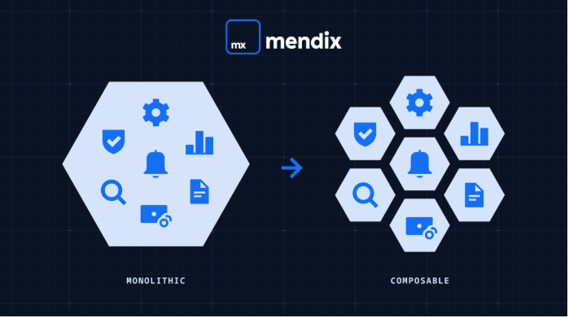

# AI Agent TypeScript Project

## Project Structure (Component-Based Architecture)

```
src/
├── index.ts                      # Entry point
├── config/
│   └── env.ts                    # Environment configuration
├── components/                   # Reusable components
│   ├── agent/
│   │   ├── Agent.ts             # Agent class
│   │   └── AgentManager.ts      # Manages multiple agents
│   └── tools/
│       ├── GoogleSheetsClient.ts
│       └── ClaudeClient.ts
├── services/                     # Business logic services
│   ├── AgentService.ts          # Agent orchestration
│   └── LessonPlanService.ts     # Domain-specific logic
├── routes/                       # API routes (composable endpoints)
│   ├── index.ts
│   ├── agent.routes.ts
│   └── health.routes.ts
├── controllers/                  # Request handlers
│   └── AgentController.ts
├── middleware/
│   ├── errorHandler.ts
│   └── validator.ts
├── types/
│   └── index.ts                 # TypeScript interfaces
└── utils/
    └── logger.ts
```

## Architecture Principles

- **Independent Components**: Each folder is self-contained
- **Composable**: Mix and match services/components
- **Reusable**: Components can be used across projects
- **Scalable**: Easy to add new agents/services
- **Maintainable**: Clear separation of concerns

Reference: [Mendix Component-Based Architecture](https://www.mendix.com/blog/what-is-component-based-architecture/)



## Setup

```bash
npm install
```

## Environment Variables

Create `.env` file:

```
PORT=3000
ANTHROPIC_API_KEY=your-api-key-here
```

## Scripts

```bash
npm run dev      # Development with hot reload
npm run build    # Compile TypeScript
npm start        # Run compiled code
```

## API Endpoints

### Health Check

```bash
GET /health
```

### Agent Management

```bash
POST   /agent/create
POST   /agent/:id/ask
GET    /agent/:id/history
POST   /agent/:id/reset
DELETE /agent/:id
```

## Development Workflow

1. Start with simple agent in `src/index.ts`
2. Extract Agent class to `src/components/agent/Agent.ts`
3. Add services as needed in `src/services/`
4. Create routes in `src/routes/`
5. Add tools (Google Sheets, etc.) in `src/components/tools/`

## Setup

```bash
npm install
```

## Development

```bash
npm run dev
```

## Build

```bash
npm run build
npm start
```

## Environment Variables

Create `.env` file:

```
PORT=3000
ANTHROPIC_API_KEY=your-api-key-here
```

## Test

```bash
curl http://localhost:3000/api/health
```
